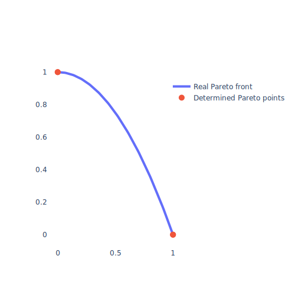
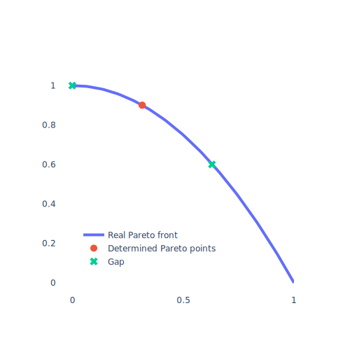
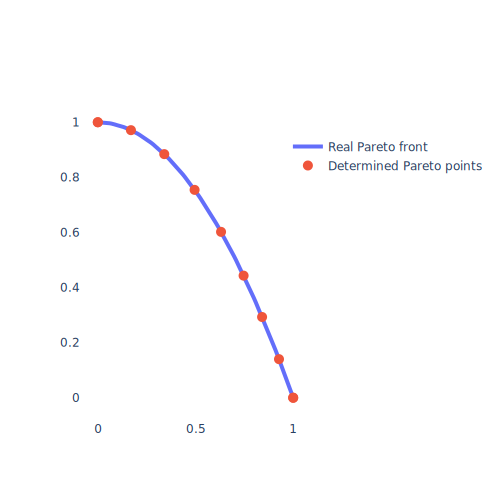
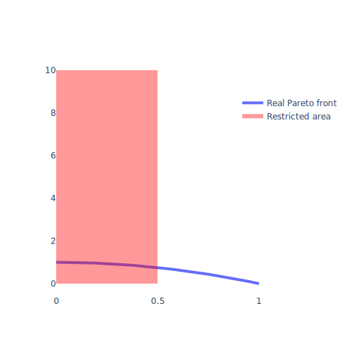

[](https://github.com/nicolaipalm/paref/actions/workflows/python-test.yml)
[](https://www.python.org/downloads/)

[documentation](https://paref.readthedocs.io/en/latest/)//[notebooks](https://github.com/nicolaipalm/paref/tree/main/docs/notebooks)

# Paref - using and building problem tailored MOO

A multi-objective optimization (MOO) problem comes with an idea of what **[
properties](#what-are-properties-of-pareto-points)** identified (Pareto) points must satisfy.
The fact that these characteristics are fulfilled is what makes a MOO successful in the first place.
Why not construct a MOO algorithm which searches exactly for those properties?
With the language of PAreto REFlections this is now possible.
This package contains...

- a series of ready-to-use [MOO algorithms](https://github.com/nicolaipalm/paref/tree/main/paref/moo_algorithms)
  corresponding to frequently targeted properties
- a framework for you to implement your problem tailored MOO algorithm
- generic and intuitive [interfaces](https://github.com/nicolaipalm/paref/tree/main/paref/interfaces) for MOO
  algorithms, black-box functions and more, so solving a MOO problem with user-defined properties with Paref requires
  only minimal effort

See the official [documentation](https://paref.readthedocs.io/en/latest/) for more information.

## Content

- [Installation](#installation)
- [Usage](#usage)
- [What are properties of Pareto points?](#what-are-properties-of-pareto-points)

## Installation

The official release is available at PyPi:

```
pip install paref
```

## Usage

Solving an MOO problem with Paref consists of the following steps

0. Define design and target space
1. Define desired properties of Pareto points
2. Initialize corresponding MOO algorithm
3. Implement and initialize bbf
4. Apply problem tailored MOO algorithm to blackbox function

This may look as follows:

0. We use a mathematical test function with three input dimensions all between zero and one (i.e. design space is given
   by three-dimensional unit cube) and with two output dimensions (i.e. target space is the real plane)
1. We want to have an idea of the "dimension" of the Pareto front (i.e. the Pareto points representing the minima in
   components) with minimum number of evaluations
2. Accordingly, we choose the ``FindEdgePoints`` algorithm:

```python
from paref.moo_algorithms.multi_dimensional.find_edge_points import FindEdgePoints

moo = FindEdgePoints()
```

3. We implement and initialize the blackbox function in the Paref blackbox function interface

```python
import numpy as np
from paref.black_box_functions.design_space.bounds import Bounds
from paref.interfaces.moo_algorithms.blackbox_function import BlackboxFunction


class TestFunction(BlackboxFunction):
    def __call__(self, x: np.ndarray) -> np.ndarray:
        y = np.array([np.sum(x ** 2), x[0]])
        self._evaluations.append([x, y])
        return y

    @property
    def dimension_design_space(self) -> int:
        return 3

    @property
    def dimension_target_space(self) -> int:
        return 2

    @property
    def design_space(self) -> Bounds:
        return Bounds(upper_bounds=np.ones(self.dimension_design_space),
                      lower_bounds=-np.zeros(self.dimension_design_space))


blackbox_function = TestFunction()
```

4. We apply the MOO algorithm to the blackbox function with a maximum number of five iterations and print the so found
   Pareto front:

```python
from paref.moo_algorithms.stopping_criteria.max_iterations_reached import MaxIterationsReached

moo(blackbox_function=blackbox_function,
    stopping_criteria=MaxIterationsReached(max_iterations=5))
print(f"Calculated Pareto front: {blackbox_function.pareto_front}")
```

## What are properties of Pareto points?

A MOO problem comes with an idea of what properties identified (Pareto) points must satisfy.
The fact that these characteristics are fulfilled is what makes a MOO successful in the first place.

In mathematical terms, we understand properties of Pareto points as being element of a
(mostly implicit defined) subset of the Pareto front.

They include but are certainly not limited to the following:

|              Property               |                                       Graphic                                        | Example |                       Algorithm(s)                       |          Sequence          |  Pareto reflection  |
|:-----------------------------------:|:------------------------------------------------------------------------------------:|:-------:|:--------------------------------------------------------:|:--------------------------:|:-------------------:|
|         Being an edge point         |           |         |                    ``FindEdgePoints``                    | ``FindEdgePointsSequence`` |                     |
|            Filling a gap            |                          |         |                                                          |                            |     ``FillGap``     |
|      Being evenly distributed       |  |         | ``FindEdgePoints`` followed by ``FillGapsOfParetoFront`` |                            |                     |
| Being constrained to a defined area |                    |         |                                                          |                            | ``RestrictByPoint`` |
