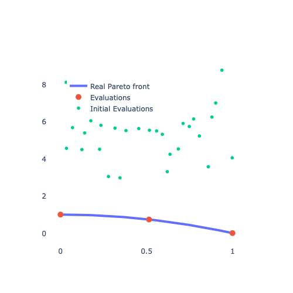
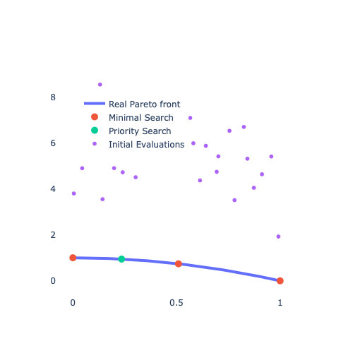
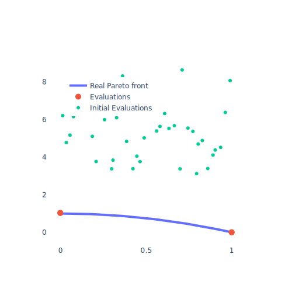
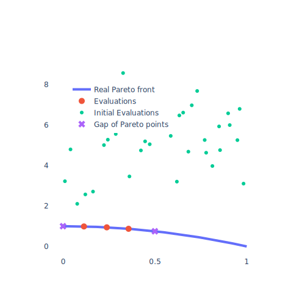
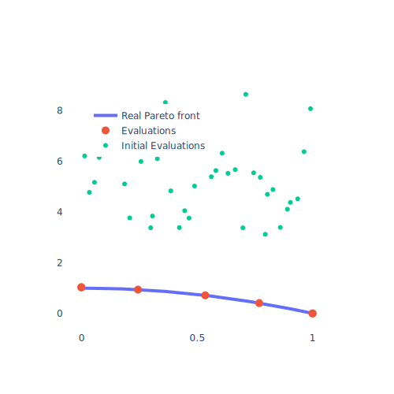

:html_theme.sidebar_secondary.remove:

# Parefs' MOO algorithms

Paref provides a series of ready to use *generic* (mainly minimization algorithms)
and *problem tailored* (i.e. targeting certain properties) MOO algorithms implemented in the ``ParefMOO`` interface.

In order to apply any MOO algorithm (except ``ExpressSearch`` which only needs the maximum number of iterations)
you need to initialize (or implement your own) ``StoppingCriteria``
indicating when to stop the optimization process and call the MOO algorithm to it and
the black-box function (bbf).

```python
from paref.moo_algorithms.multi_dimensional.find_edge_points import FindEdgePoints
from paref.moo_algorithms.stopping_criteria.max_iterations_reached import MaxIterationsReached

moo = FindEdgePoints()
stopping_criteria = MaxIterationsReached(max_iterations=10)
moo(blackbox_function=bbf, stopping_criteria=stopping_criteria)
```

All MOO algorithms are found within the ``paref.moo_algorithms`` module.
You can access the Pareto points fitting the properties best by calling the ``best_fits`` attribute.
Currently, Paref includes implementations of the following MOO algorithms
(illustrated by their corresponding property):

|                             Property                             |                                          Graphic                                           |                                                    Algorithm                                                     | Supported target space dimension |                                Note                                 |
|:----------------------------------------------------------------:|:------------------------------------------------------------------------------------------:|:----------------------------------------------------------------------------------------------------------------:|:--------------------------------:|:-------------------------------------------------------------------:|
|       Being minima of the objectives and a real trade-off        |                       |                                         ``ExpressSearch.minimal_search``                                         |               All                |                   This is a great initial search                    |
|             Being in the center of the Pareto front              |                       | ``ExpressSearch.search_for_best_real_trade_off``  (after ``ExpressSearch.search_for_minima`` for all components) |               All                |                                                                     |
|       Reflecting a user defined priority of the objectives       |                            |                    ``ExpressSearch.priority_search`` (after ``ExpressSearch.minimal_search``)                    |               All                | Higher priority results in smaller target values in that component  |
|                  Being minima of the objectives                  |                         |        ``Find1ParetoPoints`` for all components or ``ExpressSearch.search_for_minima`` for some component        |               All                |                                                                     |
|               Being edge points for all objective                |                         |                                                ``FindEdgePoints``                                                |               All                | Edge points equal the minima in some objective only in 2 dimensions |
|               Filling the gaps of the Pareto front               |  |                                           ``FillGapsOfParetoFront2D``                                            |                2                 |                                                                     |
|                     Being evenly distributed                     |                          |                              ``FillGapsOfParetoFront2D`` (after ``FindEdgePoints``)                              |                2                 |                                                                     |
|       Finding a minimum with minimum number of iterations        |                                                                                            |                                                 ``GPRMinimizer``                                                 |                1                 |                       Apply to expensive bbf                        |
| Finding a minimum with high number of iterations (for cheap bbf) |                                                                                            |                                       ``DifferentiallEvolutionMinimizer``                                        |                1                 |                         Apply to cheap bbf                          |
