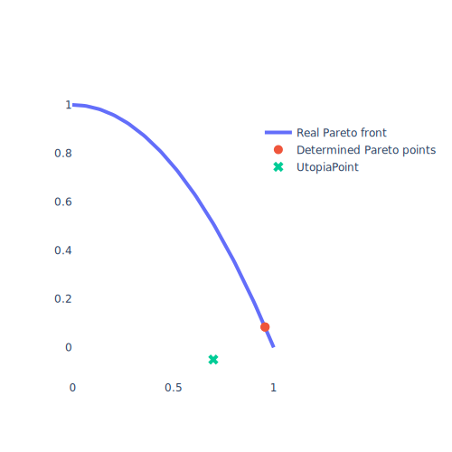

# Pareto reflections

**What are Pareto reflections?**
On a top level, Pareto reflections are functions which reflect certain properties of Pareto points.

**Why do we use Pareto reflections?**
We use Pareto reflections in order to *inject* certain properties of found Pareto points into *any* MOO algorithm.

**How do we use Pareto reflections in Paref?**
This is done by calling the ``apply_to_sequence`` method of some MOO algorithm (implemented in ``ParefMOO`` interface)
to the Pareto reflection.

Currently, Paref includes implementations of the following Pareto reflections
(illustrated by their corresponding property):

|                        Property                         |                                     Graphic                                      |        Pareto reflection         | Supported target space dimension |          Note          | Code |
|:-------------------------------------------------------:|:--------------------------------------------------------------------------------:|:--------------------------------:|:--------------------------------:|:----------------------:|:----:|
|                   Being an edge point                   |          |        ``FindEdgePoint``         |               All                |||
|                      Filling a gap                      |                          |          ``FillGap2D``           |                2                 |||
| Having minimum (weighted) distance to some utopia point |  | ``MinimizeWeightedNormToUtopia`` |               All                |||
|           Being constrained to a defined area           |                    |       ``RestrictByPoint``        |               All                |||
